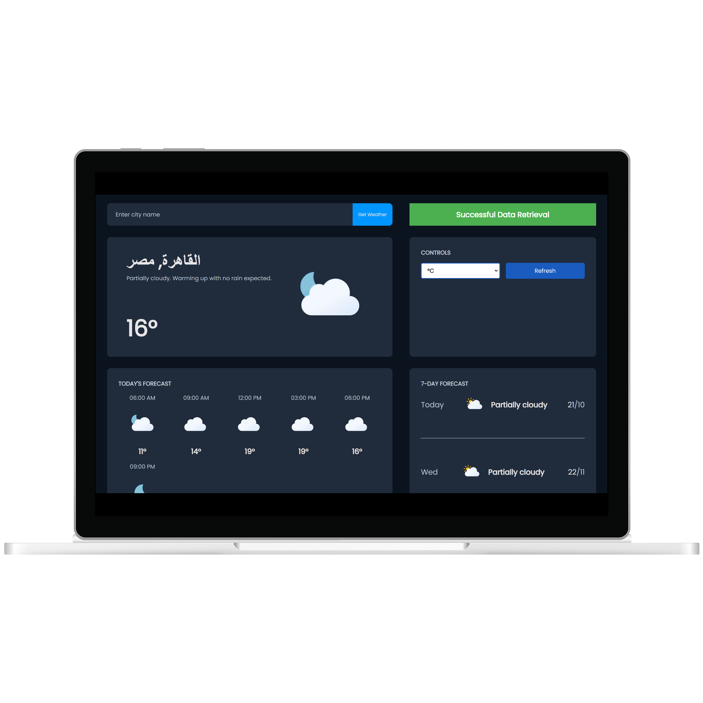
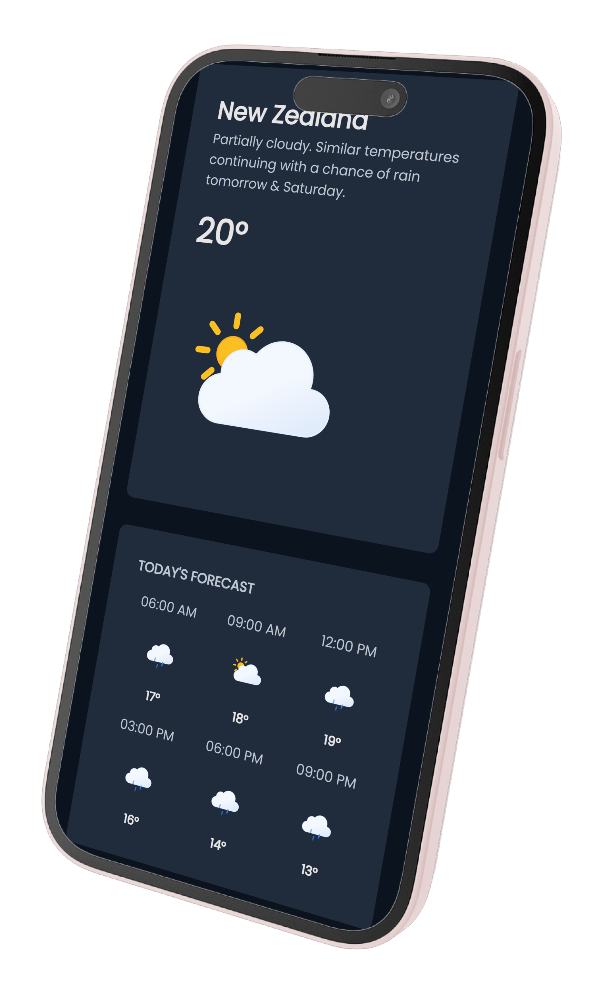

# Weather App

A modern and responsive weather application built with JavaScript, CSS, and HTML, bundled using Webpack. This app provides real-time weather data for any city worldwide, including current conditions, hourly forecasts, air conditions, and a 7-day forecast. The app leverages the Visual Crossing Weather API to fetch accurate weather data and displays it in a user-friendly interface.

## Features

- **Current Weather**: Displays the current temperature, weather conditions, and an icon representing the weather.
- **Hourly Forecast**: Provides a detailed hourly forecast for the current day.
- **7-Day Forecast**: Shows the weather forecast for the next 7 days, including temperature ranges and conditions.
- **Air Conditions**: Displays real-feel temperature, wind speed, humidity, and UV index.
- **Unit Conversion**: Allows users to switch between Celsius and Fahrenheit.
- **Responsive Design**: The app is fully responsive and works seamlessly on both desktop and mobile devices.
- **Error Handling**: Provides user-friendly error messages for invalid city names or network issues.

## Technologies Used

- **JavaScript**: Core logic and API integration.
- **CSS**: Styling and responsive design.
- **HTML**: Structure of the web pages.
- **Webpack**: Module bundler for optimizing and managing assets.
- **Visual Crossing Weather API**: Provides real-time weather data.

## Usage

1. **Enter a City Name**: Type the name of the city you want to check the weather for in the input field and click "Get Weather".
2. **View Weather Data**: The app will display the current weather, hourly forecast, air conditions, and 7-day forecast for the entered city.
3. **Switch Units**: Use the toggle button to switch between Celsius and Fahrenheit.
4. **Refresh Data**: Click the "Refresh" button to update the weather data for the current city.

## Preview

### Desktop View
  
*The Weather App on a desktop screen, showcasing the current weather, hourly forecast, air conditions, and 7-day forecast in a clean, grid-based layout.*

### Tablet/Mobile View
  
*The Weather App on a tablet or mobile device, demonstrating the responsive design with stacked elements for better readability on smaller screens.*

## Acknowledgments

- [Visual Crossing Weather API](https://www.visualcrossing.com/weather-api) for providing the weather data.
- [Poppins Font](https://fonts.google.com/specimen/Poppins) for the typography.
- [Josh's Custom CSS Reset](https://www.joshwcomeau.com/css/custom-css-reset/) for the CSS reset.

## Author

[competitive flamingo](https://github.com/competitive-flamingo)