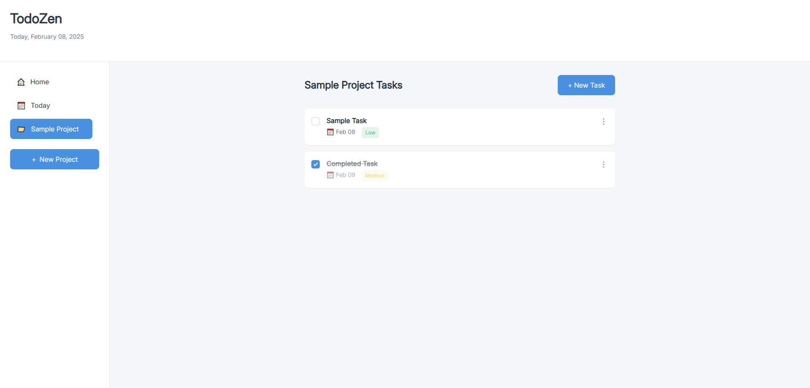

# TodoZen - A Minimal Todo App

A clean and intuitive todo application that helps you organize tasks into projects, set due dates, priorities, and never lose your progress with local storage.

## Features

- 📁 **Project Management**: Organize tasks into separate projects.
- ✅ **Task Tracking**: Add tasks with titles, descriptions, due dates, and priorities (Low/Medium/High).
- 📅 **Today View**: Automatically filters tasks due today.
- 🏠 **All Tasks View**: See every task across all projects.
- 🖋️ **Edit & Delete**: Modify or remove tasks and projects effortlessly.
- ✔️ **Checkbox Toggle**: Mark tasks as complete with a strikethrough effect.
- 💾 **Local Storage**: Data persists even after closing the browser.

## Technologies Used

- HTML, CSS, JavaScript
- [date-fns](https://date-fns.org/) for date formatting
- Modern ES6 Modules
- CSS Grid and Flexbox for layouts